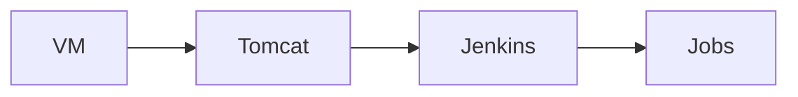

<h1 align="center"></h1>

# Installation de Jenkins

| Version | Auteur | Contenu               |
| ------- | ------ | --------------------- |
| 1.0     | Tannie | Tout ce qu'il te faut |

## 1 Introduction

### 1.1 Gloassaire

| Termes, abréviation | Définition                                |
| ------------------- | ----------------------------------------- |
| DIE                 | Document d'Installation et d'Exploitation |

### 1.2 Objet du document

Le document est là pour :

- [Donner les pré-requis du serveur pour installer le service jenkins](#22-pré-requis-à-linstallation)
- [Vous guider via une installation par github](#32-par-github)
- [Vous donner les informations nécessaire pour une installation manuelle](#33-sans-github)

## 2 Serveurs et pré-requis à l'installation

### 2.1 Rappel : architecture



### 2.2 Pré-requis de la VM à l'installation

Ressources nécessaires :

- 4GB de Ram
- 20GB d'espace disque

L'installation est faite pour un serveur **Ubuntu version 16.04.7**
Il est impératif d'avoir au moins **java 8** d'installer

`$ sudo apt-get install openjdk-8-jre`

Il vous faut un utilisateur **_jenkins_** pour pouvoir utiliser ce script d'installation.

`$ sudo useradd jenkins`

## 3 Installation complète du serveur Jenkins

### 3.1 Composants

| Composants           | Versions      | Détails                                               |
| -------------------- | ------------- | ----------------------------------------------------- |
| Serveur d'applcation | Tomcat 8.5.78 | Le serveur d'application avec lequel Jenkins se lance |
| Jenkins              | 2.332.2       | Outil d’intégration continue                          |

### 3.2 Par github

Vous pouvez installer via git

#### Pour installer git

`$ sudo apt-get install git`

#### Installation par github

`$ git clone https://github.com/T4nnie/JenkinsPackInstall-X-plus.git`

une fois dans le dossier

`$ sh scriptInstallation.sh`

### 3.3 Sans Github

Téléchargez le dossier github et envoyez le dans votre serveur _host_.

La commande `$ scp` peut vous aider.
Une fois le package présent sur votre [serveur](#2-serveurs-et-pré-requis-à-linstallation), placez vous dans le dossier et lancez la commande:

`$ sh scriptInstallation.sh`

### 3.4 Le script

```bash
#!/bin/bash

echo "Lancement de l'installation du jenkins !" | tee log.txt
#Vérification d'un dossier untilisateur jenkins
if [ -d "/home/jenkins" ]
then
    echo "Utilisateur jenkins existant" | tee -a log.txt
    else
        echo "Il n'y a pas de dossier utilisateur jenkins !" | tee -a log.txt
        exit 2
fi

#Création du serveur apache
if [ -d "/home/jenkins/apache-tomcat-8.5.78" ]
then
    echo "Il existe déjà un tomcat 8.5.78" | tee -a log.txt
    else 
        echo "Decompression du apache-tomcat-8.5.78.tar.gz dans /home/jenkins" | tee -a log.txt
        tar -zxvf resources/apache-tomcat-8.5.78.tar.gz -C /home/jenkins/
fi

#Vérification du serveur apache décompressé
if [ -d "/home/jenkins/apache-tomcat-8.5.78" ]
then
    echo "Creation du dossier apache réussi !" | tee -a log.txt
    else
        echo "Echec de la creation de l'apache" | tee -a log.txt
        exit 2
fi

#On place le fichier jenkins.war dans l'apache serveur
if [ -e "/home/jenkins/apache-tomcat-8.5.78/webapps/jenkins.war" ]
then
    echo "jenkins.war est déjà dans le tomcat" | tee -a log.txt
    else
        echo "Copie du jenkins.war dans apache-tomcat-8.5.78/webapps/" | tee -a log.txt
        cp resources/jenkins.war /home/jenkins/apache-tomcat-8.5.78/webapps/
fi

#Vérification du jenkins.war dans l'apache serveur
if [ -e "/home/jenkins/apache-tomcat-8.5.78/webapps/jenkins.war" ]
then 
    echo "Le jenkins est bien dans le dossir webapps" | tee -a log.txt
    else 
        echo "Le dossier jenkins n'a pas été copié au bon endroit" | tee -a log.txt
        exit 2
fi

#Lancement de l'apache serveur avec le jenkins dans le dossier webapps
echo "Lancement du jenkins" | tee -a log.txt

sh /home/jenkins/apache-tomcat-8.5.78/bin/startup.sh

#Vérification de l'éxecution du jenkins
if [ -d "/home/jenkins/.jenkins" ]
then 
    echo "Installation c'est bien passé" | tee -a log.txt
    else
        echo "Le lancement n'a pas fonctionné !" | tee -a log.txt
        exit 2
fi
```

### 3.5 Logs

Le script créera un fichier log.txt pour vous indiquer les détails de son exécution.

`$ cat log.txt`

### 3.6 Installation manuelle

Récupérer dans le dossier resouces :

- apache-tomcat-8.5.78.tar.gz
- jenkins.war

Dézipper l'_apache-tomcat-8.5.78.tar.gz_ dans l'home de votre utilisateur jenkins

`$ tar -zxvf resources/apache-tomcat-8.5.78.tar.gz -C /home/jenkins/`

Copier le _jenkins.war_ dans le dossier _apache-tomcat-8.5.78/webbapps_

Lancer le _`startup.sh`_ présent dans le dossier _bin_ de l'apache tomcat.

### 3.7 Accès aux jenkins

`http://ip:8080/jenkins`

Pour avoir accès à l'ip de votre machine :

`$ ip -br a`
